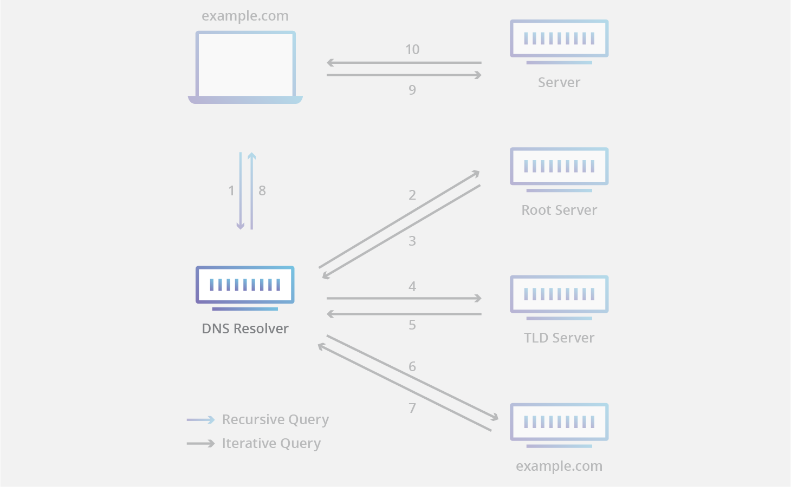
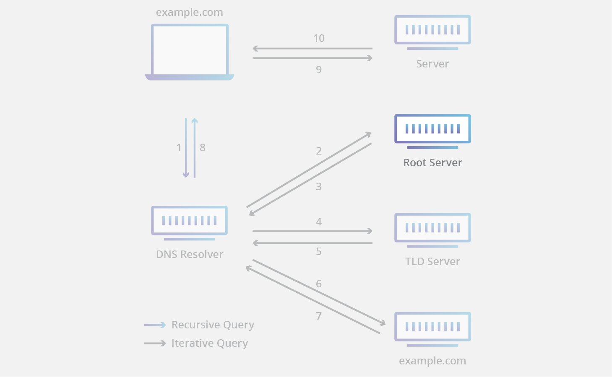
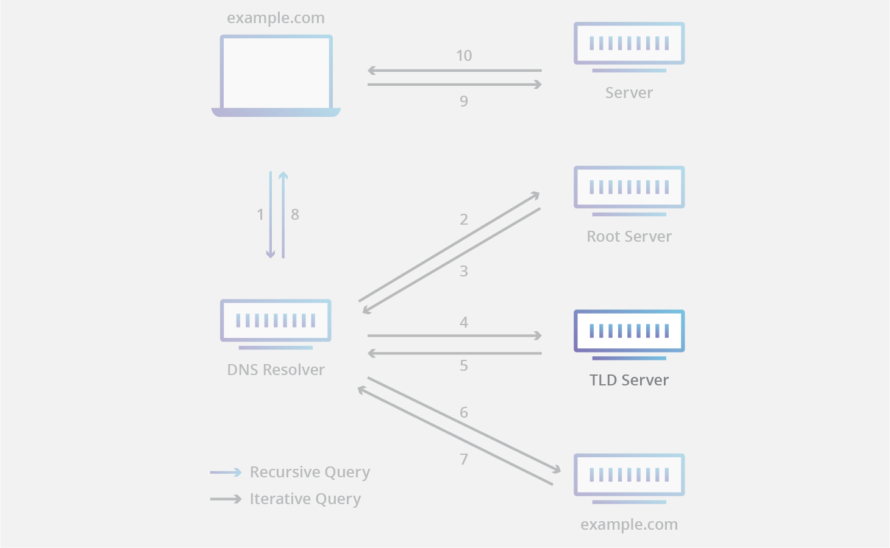
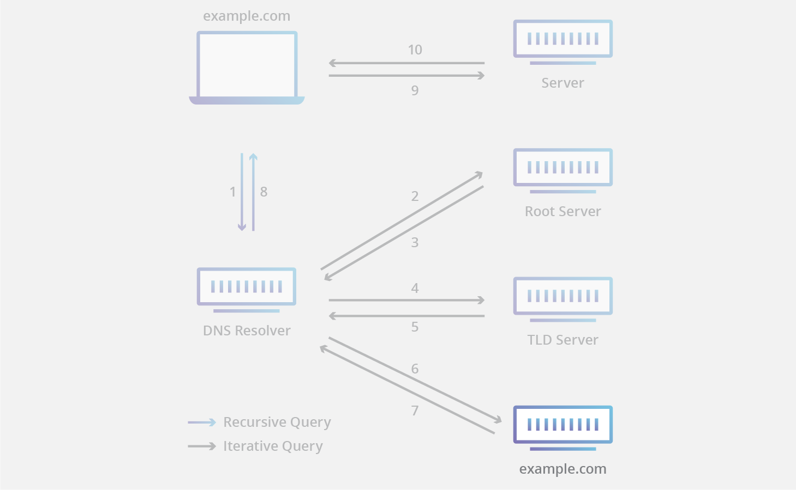

# PlayAngular

## Frontend
```sh
cd ui
npx @angular/cli new ui --directory=.

npx @angular/cli new ui # in root directory
```

By default npm run build places the artifacts in `/ui/dist/ui`
but we can change the output dir
```json
  "scripts": {
    "ng": "ng",
    "lint": "ng lint",
    "e2e": "ng e2e",
    "start": "ng serve --open --proxy-config src/proxy.conf.js --host 0.0.0.0",
    "test": "ng test --watch",
    "test:ci": "ng test --watch=false --browsers ChromeHeadless",
    "test:coverage": "ng test --watch=true --code-coverage=true",
    "test:coverage:ci": "ng test --watch=false --code-coverage=true --browsers ChromeHeadless",
    "build:dev": "ng build --progress --output-path ../public",
    "build:prod": "ng build --progress --prod --output-path ../public"
  }
  ```

## Backend


On Mac
`username@hostname` on the terminal

`lsof -i :9000` get process on port

`kill -9 process id`


```sh
"postbuild": "mkdir -p ../src/main/public && cp -r dist/*/browser/* ../src/main/public/"

"postbuild": "mkdir -p ../src/main/public && cp -r dist/projectName/browser/* ../public/"

```


`ng` is a real command installed when you install Angular (`npm install -g @angular/cli` or in `node_modules/.bin`)

`ng test --browsers=ChromeHeadless --watch=false`
without the `--watch=false`, the UI test hangs and play test never runs


```sh
    sbt clean           # Clean existing build artifacts

    sbt stage           # Build your application from your project’s source directory

    sbt run             # Run both backend and frontend builds in watch mode

    sbt dist            # Build both backend and frontend sources into a single distribution artifact

    sbt test            # Run both backend and frontend unit tests
```
## Directory Layout

```sh
├── /app/                                 # The backend source (controllers, models, services)
│     └── /controllers/                   # Backend controllers
│           └── FrontendController.scala  # Asset controller wrapper serving frontend assets and artifacts
├── /conf/                                # Configurations files and other non-compiled resources (on classpath)
│     ├── application.conf                # Play application configuratiion file.
│     ├── logback.xml                     # Logging configuration
│     └── routes                          # Routes definition file
├── /logs/                                # Log directory
│     └── application.log                 # Application log file
├── /project/                             # Contains project build configuration and plugins
│     ├── FrontendCommands.scala          # Frontend build command mapping configuration
│     ├── FrontendRunHook.scala           # Forntend build PlayRunHook (trigger frontend serve on sbt run)
│     ├── build.properties                # Marker for sbt project
│     └── plugins.sbt                     # SBT plugins declaration
├── /public/                              # Frontend build artifacts will be copied to this directory
├── /target/                              # Play project build artifact directory
│     ├── /universal/                     # Application packaging
│     └── /web/                           # Compiled web assets
├── /test/                                # Contains unit tests of backend sources
├── /ui/                                  # React frontend source (based on Create React App)
│     ├── /e2e/                           # End to end tests folder
│     ├── /node_modules/                  # 3rd-party frontend libraries and utilities
│     ├── /src/                           # The frontend source code (modules, componensts, models, directives, services etc.) of the application
│     │     ├── karma.conf.js             # Karma configuration file
│     │     └── proxy.conf.json           # UI proxy configuration      
│     ├── .angular.json                   # Angular CLI configuration
│     ├── .editorconfig                   # Define and maintain consistent coding styles between different editors and IDEs
│     ├── .gitignore                      # Contains ui files to be ignored when pushing to git
│     ├── package.json                    # NPM package configuration.
│     ├── README.md                       # Contains all user guide details for the ui
│     ├── tsconfig.json                   # Contains typescript compiler options
│     └── tslint.json                     # Lint rules for the ui
├── .gitignore                            # Contains files to be ignored when pushing to git
├── build.sbt                             # Play application SBT configuration
├── LICENSE                               # License Agreement file
├── README.md                             # Application user guide
└── ui-build.sbt                          # SBT command hooks associated with frontend npm scripts 
```


## Nginx

Create or edit an Nginx site config (e.g. `/etc/nginx/sites-available/play-app.conf`):
```conf
server {
    listen 80;
    server_name yourdomain.com;

    location / {
        proxy_pass         http://localhost:9000;
        proxy_http_version 1.1;

        proxy_set_header   Host $host;
        proxy_set_header   X-Real-IP $remote_addr;
        proxy_set_header   X-Forwarded-For $proxy_add_x_forwarded_for;
        proxy_set_header   X-Forwarded-Proto $scheme;

        proxy_connect_timeout       60s;
        proxy_send_timeout          60s;
        proxy_read_timeout          60s;
    }
}

```

```sh
sudo ln -s /etc/nginx/sites-available/play-app.conf /etc/nginx/sites-enabled/

sudo nginx -t
sudo systemctl reload nginx
```

`ln -s`: Create a symbolic link (like a shortcut) rather than copying the file.

`/etc/nginx/sites-available/play-app.conf`: This is the original config file you created for your Play app.

`/etc/nginx/sites-enabled/`: This is the directory Nginx uses to activate site configs.

- `sites-available/` is where you store all your Nginx site configurations (even those not currently active).

`sites-enabled/` is where Nginx looks for configs to actually load and serve.

Linking the file into s`ites-enabled/` makes it active without duplicating it.

###  Enable multiple sites

```sh
sudo ln -s /etc/nginx/sites-available/site1.conf /etc/nginx/sites-enabled/
sudo ln -s /etc/nginx/sites-available/site2.conf /etc/nginx/sites-enabled/
sudo ln -s /etc/nginx/sites-available/site3.conf /etc/nginx/sites-enabled/
```

After Linking
You must reload or restart Nginx for changes to take effect:

```sh
sudo nginx -t         # Test the configuration for errors
sudo systemctl reload nginx

```


## Nginx Load Balancing Setup for Play Apps

1. Define an upstream block

Edit your Nginx config (e.g. /`etc/nginx/sites-available/play-lb.conf`):

```conf
upstream play_backend {
    server 127.0.0.1:9000;
    server 127.0.0.1:9001;
    server 127.0.0.1:9002;
    # Optional: Add weights or use least_conn/fair module if installed
}

server {
    listen 80;
    server_name yourdomain.com;

    location / {
        proxy_pass http://play_backend;
        proxy_http_version 1.1;

        # Required headers for Play
        proxy_set_header Host $host;
        proxy_set_header X-Real-IP $remote_addr;
        proxy_set_header X-Forwarded-For $proxy_add_x_forwarded_for;
        proxy_set_header X-Forwarded-Proto $scheme;

        proxy_connect_timeout 60s;
        proxy_send_timeout 60s;
        proxy_read_timeout 60s;
    }
}
```

2.  Enable Config

```sh
sudo ln -s /etc/nginx/sites-available/play-lb.conf /etc/nginx/sites-enabled/
sudo nginx -t
sudo systemctl reload nginx
```

3. Configure Play for Reverse Proxy

```conf
play.http.forwarded.enabled = true
play.http.forwarded.trustedProxies = ["127.0.0.1"]
```

4. Run Your Play Instances
Make sure you run each Play instance on its own port:

```sh
sbt "run 9000"
sbt "run 9001"
sbt "run 9002"
```


**With play.http.forwarded.enabled = true**
Play will instead read and trust:

- X-Forwarded-For: gets the real client IP

- X-Forwarded-Proto: gets whether the client used HTTPS

- Host: gets the actual hostname from the browser

## using systemd to start play
 Create a systemd Unit for Play
`/etc/systemd/system/play-app.service`


```conf
[Unit]
Description=Play Framework Application
After=network.target

[Service]
WorkingDirectory=/opt/play-app
ExecStart=/opt/play-app/bin/your-app -Dhttp.port=9000
Restart=always
User=playuser
Environment=JAVA_HOME=/usr/lib/jvm/java-17-openjdk
Environment=PATH=/usr/bin:/bin

[Install]
WantedBy=multi-user.target
```

```sh
sudo systemctl daemon-reexec  #sudo systemctl daemon-reload

sudo systemctl enable --now play-app

#enable: Adds the play-app.service to auto-start at boot.

#--now: Starts the service immediately, right after enabling it.
```

Private networks are defined by RFC 1918 and include:

- Class A: 10.0.0.0/8
24 host bits and 8 network bits
- Class B: 172.16.0.0/12
Only this 172.x range is private. Everything outside 172.16.0.0 – 172.31.255.255 is public.

20 host bits and 12 network bits


`This entire range is a single /12 network.`

- Class C: 192.168.0.0/16
exactly one /16 network

- 10.0.0.0/8 IP addresses: `10.0.0.0 – 10.255.255.255`
- 172.16.0.0/12 IP addresses: `172.16.0.0 – 172.31.255.255`
- 192.168.0.0/16 IP addresses: `192.168.0.0 – 192.168.255.255`

we can break /16 into 4 /18
```sh
| **Subnet**         | **Range**                         | **Usable IPs** |
|--------------------|------------------------------------|----------------|
| `192.168.0.0/18`   | `192.168.0.1` – `192.168.63.254`   | 16,382         |
| `192.168.64.0/18`  | `192.168.64.1` – `192.168.127.254` | 16,382         |
| `192.168.128.0/18` | `192.168.128.1` – `192.168.191.254`| 16,382         |
| `192.168.192.0/18` | `192.168.192.1` – `192.168.255.254`| 16,382         |
```

`65,536 (total addresses in /16) ÷ 256 (addresses in /24) = 256 subnets`

/16 into 256  different /24 subnets
```sh
| **/24 Subnet**         | **Range**                          | **Usable IPs** |
|------------------------|-------------------------------------|----------------|
| `192.168.0.0/24`       | `192.168.0.1` – `192.168.0.254`    | 254            |
| `192.168.1.0/24`       | `192.168.1.1` – `192.168.1.254`    | 254            |
| `192.168.2.0/24`       | `192.168.2.1` – `192.168.2.254`    | 254            |
| `192.168.3.0/24`       | `192.168.3.1` – `192.168.3.254`    | 254            |
| `192.168.4.0/24`       | `192.168.4.1` – `192.168.4.254`    | 254            |
| ...                    | ...                                 | ...            |
| `192.168.254.0/24`     | `192.168.254.1` – `192.168.254.254`| 254            |
| `192.168.255.0/24`     | `192.168.255.1` – `192.168.255.254`| 254            |
```


search github
`nginx content:production path:*.conf`


AnyCast
- DNS
- CDN- Reduce latency by serving content from the geographically nearest node


```sh
List of Root Servers
Hostname	       IP Addresses	      Operator
a.root-servers.net	198.41.0.4, 2001:503:ba3e::2:30	Verisign, Inc.
b.root-servers.net	170.247.170.2, 2801:1b8:10::b	University of Southern California,
Information Sciences Institute
c.root-servers.net	192.33.4.12, 2001:500:2::c	Cogent Communications
d.root-servers.net	199.7.91.13, 2001:500:2d::d	University of Maryland
e.root-servers.net	192.203.230.10, 2001:500:a8::e	NASA (Ames Research Center)
f.root-servers.net	192.5.5.241, 2001:500:2f::f	Internet Systems Consortium, Inc.
g.root-servers.net	192.112.36.4, 2001:500:12::d0d	US Department of Defense (NIC)
h.root-servers.net	198.97.190.53, 2001:500:1::53	US Army (Research Lab)
i.root-servers.net	192.36.148.17, 2001:7fe::53	Netnod
j.root-servers.net	192.58.128.30, 2001:503:c27::2:30	Verisign, Inc.
k.root-servers.net	193.0.14.129, 2001:7fd::1	RIPE NCC
l.root-servers.net	199.7.83.42, 2001:500:9f::42	ICANN
m.root-servers.net	202.12.27.33, 2001:dc3::35	WIDE Project
```

both root servers and tld servers use Anycast

The administration of the Domain Name System (DNS) is structured in a hierarchy using different managed areas or “zones”.
These servers can directly answer queries for records stored or cached within the root zone, and they can also refer other requests to the appropriate Top Level Domain (TLD) server. The TLD servers are the DNS server group one step below root servers in the DNS hierarchy, and they are an integral part of resolving DNS queries.


There are 13 different IP addresses that serve the DNS root zone, and hundreds of redundant root servers exist around the globe to handle requests to the root zone.


Today each of the 13 IP addresses has several servers, which use Anycast routing to distribute requests based on load and proximity. Right now there are over 600 different DNS root servers distributed across every populated continent on earth.


```
sh
[User]
   |
   v
[Registrar] --> [Registry for .com] --> [TLD Name Servers (e.g., a.gtld-servers.net)]
                                                      |
                                                      v
                                        (Returns NS for example.com)
```

every DNS resolver has a list of the 13 IP root server addresses built into its software. Whenever a DNS lookup is initiated, the recursor’s first communication is with one of those 13 IP addresses.

```sh
dig +norecurse @198.41.0.4 google.com
```
This uses the `a.root-servers.net` Root Server's IP directly (198.41.0.4) and sends a non-recursive query

```sh
; <<>> DiG 9.10.6 <<>> +norecurse @198.41.0.4 google.com
; (1 server found)
;; global options: +cmd
;; Got answer:
;; ->>HEADER<<- opcode: QUERY, status: NOERROR, id: 6585
;; flags: qr; QUERY: 1, ANSWER: 0, AUTHORITY: 13, ADDITIONAL: 27

;; OPT PSEUDOSECTION:
; EDNS: version: 0, flags:; udp: 4096
;; QUESTION SECTION:
;google.com.			IN	A

;; AUTHORITY SECTION:
com.			172800	IN	NS	l.gtld-servers.net.
com.			172800	IN	NS	j.gtld-servers.net.
com.			172800	IN	NS	h.gtld-servers.net.
com.			172800	IN	NS	d.gtld-servers.net.
com.			172800	IN	NS	b.gtld-servers.net.
com.			172800	IN	NS	f.gtld-servers.net.
com.			172800	IN	NS	k.gtld-servers.net.
com.			172800	IN	NS	m.gtld-servers.net.
com.			172800	IN	NS	i.gtld-servers.net.
com.			172800	IN	NS	g.gtld-servers.net.
com.			172800	IN	NS	a.gtld-servers.net.
com.			172800	IN	NS	c.gtld-servers.net.
com.			172800	IN	NS	e.gtld-servers.net.

;; ADDITIONAL SECTION:
l.gtld-servers.net.	172800	IN	A	192.41.162.30
l.gtld-servers.net.	172800	IN	AAAA	2001:500:d937::30
j.gtld-servers.net.	172800	IN	A	192.48.79.30
j.gtld-servers.net.	172800	IN	AAAA	2001:502:7094::30
h.gtld-servers.net.	172800	IN	A	192.54.112.30
h.gtld-servers.net.	172800	IN	AAAA	2001:502:8cc::30
d.gtld-servers.net.	172800	IN	A	192.31.80.30
d.gtld-servers.net.	172800	IN	AAAA	2001:500:856e::30
b.gtld-servers.net.	172800	IN	A	192.33.14.30
b.gtld-servers.net.	172800	IN	AAAA	2001:503:231d::2:30
f.gtld-servers.net.	172800	IN	A	192.35.51.30
f.gtld-servers.net.	172800	IN	AAAA	2001:503:d414::30
k.gtld-servers.net.	172800	IN	A	192.52.178.30
k.gtld-servers.net.	172800	IN	AAAA	2001:503:d2d::30
m.gtld-servers.net.	172800	IN	A	192.55.83.30
m.gtld-servers.net.	172800	IN	AAAA	2001:501:b1f9::30
i.gtld-servers.net.	172800	IN	A	192.43.172.30
i.gtld-servers.net.	172800	IN	AAAA	2001:503:39c1::30
g.gtld-servers.net.	172800	IN	A	192.42.93.30
g.gtld-servers.net.	172800	IN	AAAA	2001:503:eea3::30
a.gtld-servers.net.	172800	IN	A	192.5.6.30
a.gtld-servers.net.	172800	IN	AAAA	2001:503:a83e::2:30
c.gtld-servers.net.	172800	IN	A	192.26.92.30
c.gtld-servers.net.	172800	IN	AAAA	2001:503:83eb::30
e.gtld-servers.net.	172800	IN	A	192.12.94.30
e.gtld-servers.net.	172800	IN	AAAA	2001:502:1ca1::30

;; Query time: 212 msec
;; SERVER: 198.41.0.4#53(198.41.0.4)
;; WHEN: Sat May 03 14:37:58 +04 2025
;; MSG SIZE  rcvd: 835

```


Even though each .com TLD name server (like a.gtld-servers.net, b.gtld-servers.net, etc.) has its own unique IP address, each of those IP addresses is Anycasted — meaning the same IP is announced in multiple physical locations around the world.

`a.gtld-servers.net` has ip address `192.5.6.30` and this one IP address is used by many physical servers around the world (e.g., in Tokyo, Paris, New York)

when you query `192.5.6.30`,You are routed to the nearest instance of that IP, thanks to Anycast routing via BGP (Border Gateway Protocol).

Someone else on another continent querying the same IP might reach a completely different physical server.

```sh
;; QUESTION SECTION:
;google.com.			IN	A

```

the root server returns 13 authoritative name servers for the `.com` TLD.

```sh
; <<>> DiG 9.10.6 <<>> +norecurse @170.247.170.2 google.com
; (1 server found)
;; global options: +cmd
;; Got answer:
;; ->>HEADER<<- opcode: QUERY, status: NOERROR, id: 1498
;; flags: qr; QUERY: 1, ANSWER: 0, AUTHORITY: 13, ADDITIONAL: 27

;; OPT PSEUDOSECTION:
; EDNS: version: 0, flags:; udp: 1232
;; QUESTION SECTION:
;google.com.			IN	A

;; AUTHORITY SECTION:
com.			172800	IN	NS	a.gtld-servers.net.
com.			172800	IN	NS	b.gtld-servers.net.
com.			172800	IN	NS	c.gtld-servers.net.
com.			172800	IN	NS	d.gtld-servers.net.
com.			172800	IN	NS	e.gtld-servers.net.
com.			172800	IN	NS	f.gtld-servers.net.
com.			172800	IN	NS	g.gtld-servers.net.
com.			172800	IN	NS	h.gtld-servers.net.
com.			172800	IN	NS	i.gtld-servers.net.
com.			172800	IN	NS	j.gtld-servers.net.
com.			172800	IN	NS	k.gtld-servers.net.
com.			172800	IN	NS	l.gtld-servers.net.
com.			172800	IN	NS	m.gtld-servers.net.

;; ADDITIONAL SECTION:
a.gtld-servers.net.	172800	IN	A	192.5.6.30
a.gtld-servers.net.	172800	IN	AAAA	2001:503:a83e::2:30
b.gtld-servers.net.	172800	IN	A	192.33.14.30
b.gtld-servers.net.	172800	IN	AAAA	2001:503:231d::2:30
c.gtld-servers.net.	172800	IN	A	192.26.92.30
c.gtld-servers.net.	172800	IN	AAAA	2001:503:83eb::30
d.gtld-servers.net.	172800	IN	A	192.31.80.30
d.gtld-servers.net.	172800	IN	AAAA	2001:500:856e::30
e.gtld-servers.net.	172800	IN	A	192.12.94.30
e.gtld-servers.net.	172800	IN	AAAA	2001:502:1ca1::30
f.gtld-servers.net.	172800	IN	A	192.35.51.30
f.gtld-servers.net.	172800	IN	AAAA	2001:503:d414::30
g.gtld-servers.net.	172800	IN	A	192.42.93.30
g.gtld-servers.net.	172800	IN	AAAA	2001:503:eea3::30
h.gtld-servers.net.	172800	IN	A	192.54.112.30
h.gtld-servers.net.	172800	IN	AAAA	2001:502:8cc::30
i.gtld-servers.net.	172800	IN	A	192.43.172.30
i.gtld-servers.net.	172800	IN	AAAA	2001:503:39c1::30
j.gtld-servers.net.	172800	IN	A	192.48.79.30
j.gtld-servers.net.	172800	IN	AAAA	2001:502:7094::30
k.gtld-servers.net.	172800	IN	A	192.52.178.30
k.gtld-servers.net.	172800	IN	AAAA	2001:503:d2d::30
l.gtld-servers.net.	172800	IN	A	192.41.162.30
l.gtld-servers.net.	172800	IN	AAAA	2001:500:d937::30
m.gtld-servers.net.	172800	IN	A	192.55.83.30
m.gtld-servers.net.	172800	IN	AAAA	2001:501:b1f9::30

;; Query time: 575 msec
;; SERVER: 170.247.170.2#53(170.247.170.2)
;; WHEN: Sat May 03 15:18:23 +04 2025
;; MSG SIZE  rcvd: 835
```
using `b.root-servers.net`,a different root  server from `a.root-servers.net` gets you the same result


- Now pick one of the tld servers and query it
```sh
dig +norecurse @192.5.6.30 google.com
```
So we picked `a.gtld-servers.net.` with ip `192.5.6.30` and sent a dns query

```sh
; <<>> DiG 9.10.6 <<>> +norecurse @192.5.6.30 google.com
; (1 server found)
;; global options: +cmd
;; Got answer:
;; ->>HEADER<<- opcode: QUERY, status: NOERROR, id: 14095
;; flags: qr; QUERY: 1, ANSWER: 0, AUTHORITY: 4, ADDITIONAL: 9

;; OPT PSEUDOSECTION:
; EDNS: version: 0, flags:; udp: 4096
;; QUESTION SECTION:
;google.com.			IN	A

;; AUTHORITY SECTION:
google.com.		172800	IN	NS	ns2.google.com.
google.com.		172800	IN	NS	ns1.google.com.
google.com.		172800	IN	NS	ns3.google.com.
google.com.		172800	IN	NS	ns4.google.com.

;; ADDITIONAL SECTION:
ns2.google.com.		172800	IN	AAAA	2001:4860:4802:34::a
ns2.google.com.		172800	IN	A	216.239.34.10
ns1.google.com.		172800	IN	AAAA	2001:4860:4802:32::a
ns1.google.com.		172800	IN	A	216.239.32.10
ns3.google.com.		172800	IN	AAAA	2001:4860:4802:36::a
ns3.google.com.		172800	IN	A	216.239.36.10
ns4.google.com.		172800	IN	AAAA	2001:4860:4802:38::a
ns4.google.com.		172800	IN	A	216.239.38.10

;; Query time: 210 msec
;; SERVER: 192.5.6.30#53(192.5.6.30)
;; WHEN: Sat May 03 19:04:45 +04 2025
;; MSG SIZE  rcvd: 287

```
`ANSWER`	Empty — because the `.com` server doesn’t store `A` records for domains

`SERVER`- asked one of the `.com` authoritative TLD servers directly

The `dot(.)` at the end means ` Fully Qualified Domain Name.`
So technically: `a.gtld-servers.net.` means `"a" in "gtld-servers" in "net" in the root (".") zone.`

```sh
dig a.gtld-servers.net
; <<>> DiG 9.10.6 <<>> a.gtld-servers.net
;; global options: +cmd
;; Got answer:
;; ->>HEADER<<- opcode: QUERY, status: NOERROR, id: 37875
;; flags: qr rd ra; QUERY: 1, ANSWER: 1, AUTHORITY: 0, ADDITIONAL: 1

;; OPT PSEUDOSECTION:
; EDNS: version: 0, flags:; udp: 1232
;; QUESTION SECTION:
;a.gtld-servers.net.		IN	A

;; ANSWER SECTION:
a.gtld-servers.net.	86400	IN	A	192.5.6.30

;; Query time: 773 msec
;; SERVER: 1.1.1.3#53(1.1.1.3)
;; WHEN: Sat May 03 19:00:25 +04 2025
;; MSG SIZE  rcvd: 63

```

```sh
dig a.gtld-servers.net.

; <<>> DiG 9.10.6 <<>> a.gtld-servers.net.
;; global options: +cmd
;; Got answer:
;; ->>HEADER<<- opcode: QUERY, status: NOERROR, id: 46934
;; flags: qr rd ra; QUERY: 1, ANSWER: 1, AUTHORITY: 0, ADDITIONAL: 1

;; OPT PSEUDOSECTION:
; EDNS: version: 0, flags:; udp: 1232
;; QUESTION SECTION:
;a.gtld-servers.net.		IN	A

;; ANSWER SECTION:
a.gtld-servers.net.	86384	IN	A	192.5.6.30

;; Query time: 29 msec
;; SERVER: 1.1.1.3#53(1.1.1.3)
;; WHEN: Sat May 03 19:00:41 +04 2025
;; MSG SIZE  rcvd: 63

```

Now ask one of the authoritative name servers
```sh
dig +norecurse @216.239.34.10 google.com

; <<>> DiG 9.10.6 <<>> +norecurse @216.239.34.10 google.com
; (1 server found)
;; global options: +cmd
;; Got answer:
;; ->>HEADER<<- opcode: QUERY, status: NOERROR, id: 41140
;; flags: qr aa; QUERY: 1, ANSWER: 1, AUTHORITY: 0, ADDITIONAL: 1

;; OPT PSEUDOSECTION:
; EDNS: version: 0, flags:; udp: 512
;; QUESTION SECTION:
;google.com.			IN	A

;; ANSWER SECTION:
google.com.		300	IN	A	142.251.47.206

;; Query time: 238 msec
;; SERVER: 216.239.34.10#53(216.239.34.10)
;; WHEN: Sat May 03 19:20:50 +04 2025
;; MSG SIZE  rcvd: 55

```
- queried `@216.239.34.10`, which is `ns2.google.com`, one of Google’s authoritative nameservers
- The response came from an authoritative source (note the `aa` flag in the header: `flags: qr aa;`), meaning this is the final truth.
We got a `Question` and `Answer` section




A recursive resolver (also known as a DNS recursor) is the first stop in a DNS query.
After receiving a DNS query from a web client, a recursive resolver will either respond with cached data, or send a request to a root nameserver, followed by another request to a TLD nameserver, and then one last request to an authoritative nameserver. After receiving a response from the authoritative nameserver containing the requested IP address, the recursive resolver then sends a response to the client.


A root server accepts a recursive resolver’s query which includes a domain name, and the root nameserver responds by directing the recursive resolver to a TLD nameserver, based on the extension of that domain (.com, .net, .org, etc.)



A TLD nameserver maintains information for all the domain names that share a common domain extension, such as .com, .net, or whatever comes after the last dot in a URL. For example, a .com TLD nameserver contains information for every website that ends in ‘.com’. If a user was searching for google.com, after receiving a response from a root nameserver, the recursive resolver would then send a query to a .com TLD nameserver, which would respond by pointing to the authoritative nameserver  for that domain

All 13 tld servers for `.com` are managed by Verisign-- the registry

`A zone is a chunk of DNS data — a file with domain-to-nameserver or domain-to-IP mappings`



When a recursive resolver receives a response from a TLD nameserver, that response will direct the resolver to an authoritative nameserver. The authoritative nameserver is usually the resolver’s last step in the journey for an IP address. The authoritative nameserver contains information specific to the domain name it serves (e.g. google.com) and it can provide a recursive resolver with the IP address of that server found in the DNS A record, or if the domain has a CNAME record (alias) it will provide the recursive resolver with an alias domain, at which point the recursive resolver will have to perform a whole new DNS lookup to procure a record from an authoritative nameserver (often an A record containing an IP address)

[learning/dns/dns-server-types/#authoritative-nameserver](https://www.cloudflare.com/learning/dns/dns-server-types/#authoritative-nameserver)


```scala

/**
 * Useful prewired mixins for controller components, assuming an available [[ControllerComponents]].
 *
 * If you want to extend your own [[AbstractController]] but want to use a different base "Action",
 * you can mix in this trait.
 */
trait BaseControllerHelpers extends ControllerHelpers {

  /**
   * The components needed to use the controller methods
   */
  protected def controllerComponents: ControllerComponents

  /**
   * The default body parsers provided by Play. This can be used along with the Action helper to customize the body
   * parser, for example:
   *
   * {{{
   *   def foo(query: String) = Action(parse.tolerantJson) { request =>
   *     Ok(request.body)
   *   }
   * }}}
   */
  def parse: PlayBodyParsers = controllerComponents.parsers

  implicit lazy val defaultFormBinding: FormBinding = parse.formBinding(parse.DefaultMaxTextLength)

  /**
   * The default execution context provided by Play. You should use this for non-blocking code only. You can do so by
   * passing it explicitly, or by defining an implicit in your controller like so:
   *
   * {{{
   *   implicit lazy val executionContext = defaultExecutionContext
   * }}}
   */
  def defaultExecutionContext: ExecutionContext = controllerComponents.executionContext

  /**
   * The MessagesApi provided by Play. This can be used to provide the MessagesApi needed by play.api.i18n.I18nSupport.
   */
  implicit def messagesApi: MessagesApi = controllerComponents.messagesApi

  /**
   * The default Langs provided by Play. Can be used to determine the application's supported languages.
   */
  implicit def supportedLangs: Langs = controllerComponents.langs

  /**
   * The default FileMimeTypes provided by Play. Used to map between file name extensions and mime types.
   */
  implicit def fileMimeTypes: FileMimeTypes = controllerComponents.fileMimeTypes
}

/**
 * Useful mixin for methods that do implicit transformations of a request
 */
trait RequestImplicits {

  /**
   * Retrieves the session implicitly from the request.
   *
   * For example:
   * {{{
   * def index(name:String) = Action { implicit request =>
   *   val username = request2session("username")
   *   Ok("Hello " + username)
   * }
   * }}}
   */
  implicit def request2session(implicit request: RequestHeader): Session = request.session

  /**
   * Retrieve the flash scope implicitly from the request.
   *
   * For example:
   * {{{
   * def index(name:String) = Action { implicit request =>
   *   val message = request2flash("message")
   *   Ok("Got " + message)
   * }
   * }}}
   */
  implicit def request2flash(implicit request: RequestHeader): Flash = request.flash
}

/**
 * Defines utility methods to generate `Action` and `Results` types.
 *
 * For example:
 * {{{
 * class HomeController @Inject() (val controllerComponents: ControllerComponents) extends BaseController {
 *
 *   def hello(name:String) = Action { request =>
 *     Ok("Hello " + name)
 *   }
 *
 * }
 * }}}
 *
 * This is intended to provide the idiomatic Play API for actions, allowing you to use "Action" for the default
 * action builder and "parse" to access Play's default body parsers. You may want to extend this to provide your own
 * base controller class, or write your own version with similar code.
 */
trait BaseController extends BaseControllerHelpers {

  /**
   * The default ActionBuilder. Used to construct an action, for example:
   *
   * {{{
   *   def foo(query: String) = Action {
   *     Ok
   *   }
   * }}}
   *
   * This is meant to be a replacement for the now-deprecated Action object, and can be used in the same way.
   */
  def Action: ActionBuilder[Request, AnyContent] = controllerComponents.actionBuilder
}


/**
 * An abstract implementation of [[BaseController]] to make it slightly easier to use.
 */
abstract class AbstractController(protected val controllerComponents: ControllerComponents) extends BaseController


/**
 * The base controller components dependencies that most controllers rely on.
 */
trait ControllerComponents {
  def actionBuilder: ActionBuilder[Request, AnyContent]
  def parsers: PlayBodyParsers
  def messagesApi: MessagesApi
  def langs: Langs
  def fileMimeTypes: FileMimeTypes
  def executionContext: scala.concurrent.ExecutionContext
}

case class DefaultControllerComponents @Inject() (
    actionBuilder: DefaultActionBuilder,
    parsers: PlayBodyParsers,
    messagesApi: MessagesApi,
    langs: Langs,
    fileMimeTypes: FileMimeTypes,
    executionContext: scala.concurrent.ExecutionContext
) extends ControllerComponents
```


HA proxy


When a client requests the following:

`scope=openid profile email.read`


The IdentityServer:

Looks up the identity resources matching profile and email.read

Each identity resource defines:

- Its name (used as a scope)

- The claims it includes (e.g., given_name, email, etc.)

```
new IdentityResource
{
    Name = "profile",
    DisplayName = "User profile",
    UserClaims = { "name", "family_name", "given_name", "birthdate" }
}
```

```c#
new IdentityResource
{
    Name = "profile",
    DisplayName = "User profile",
    UserClaims = { "name", "family_name", "given_name", "birthdate" }
}
```


As long as this identity resource exists and is included in the requested scopes, IdentityServer will:

- Call your IProfileService implementation

- Ask it to populate the requested claims

- Include them in the ID token or UserInfo endpoint


ID Token (when openid is requested)
If the client requests `scope=openid profile`, the claims from profile (e.g., name, given_name, etc.) are returned via IProfileService.

- Access Token (for APIs)
By default, only claims from API resources (not identity resources like profile) are included in access tokens.


Play picks the first route in declaration order.

[compression](https://cefboud.com/posts/compression/)